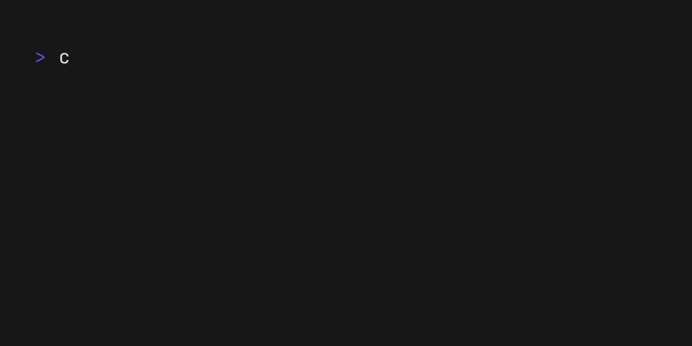

<div align="center">
<h1>Cracked</h1>
<h2>Download and train your retro-engineering skills 🖳</h2>
</div>
</br>



## What is Cracked?

Cracked is a TUI for downloading quickly [crackmes.one](https://crackmes.one/) challenges while staying in your terminal.

## How to use Cracked?

### Installation

```bash
cargo install cracked
```

### Usage

```bash
$ cracked --help

Usage: cracked [OPTIONS]

Options:
  -n, --name <NAME>              Challenge name to search for
  -a, --author <AUTHOR>          Challenge author to search for
  -d, --difficulty <DIFFICULTY>  Difficulty level [possible values: easy, medium, hard, hardcore]
  -q, --quality <QUALITY>        Quality level [possible values: poor, flaky, good, mint]
  -l, --language <LANGUAGE>      Programming language [possible values: c, asm, java, go, rust, wasm, basic, delphi, pascal, dotnet, other]
      --arch <ARCH>              Architecture [possible values: x86, x64, java, arm, mips, riscv, other]
  -p, --platform <PLATFORM>      Platform [possible values: dos, macos, multiplatform, unix, windows, winxp, win7, android, ios, other]
  -h, --help                     Print help
```

Once you downloaded a challenge, it's really likely that it'll be a password protected zip file. Don't panic, you won't need to
crack the zip. The password is `crackmes.one`.

That's pretty much it. Have fun!

## Last note

Thanks a lot to [crackmes.one](https://crackmes.one/) for providing the challenges. This website is awesome and
this CLI wouldn't exist without it.

Finally, this CLI wasn't build by the crackmes team. I'm not affiliated to them so consider this repo as a bootleg more than anything.
